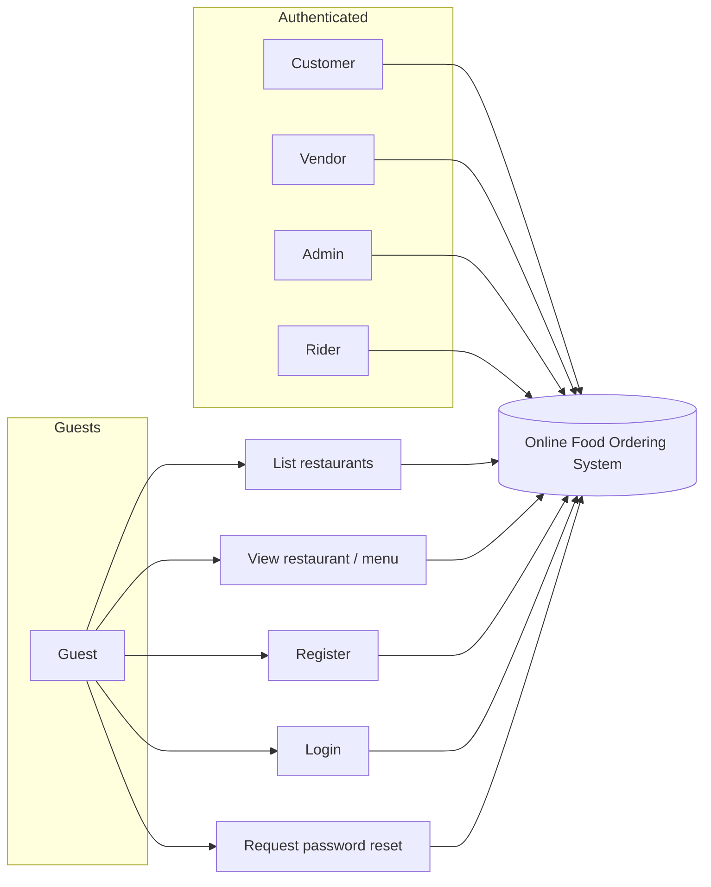
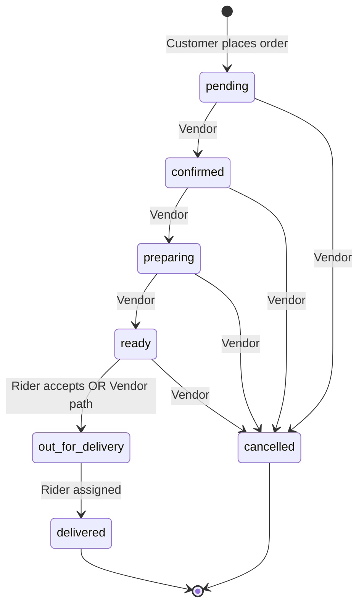
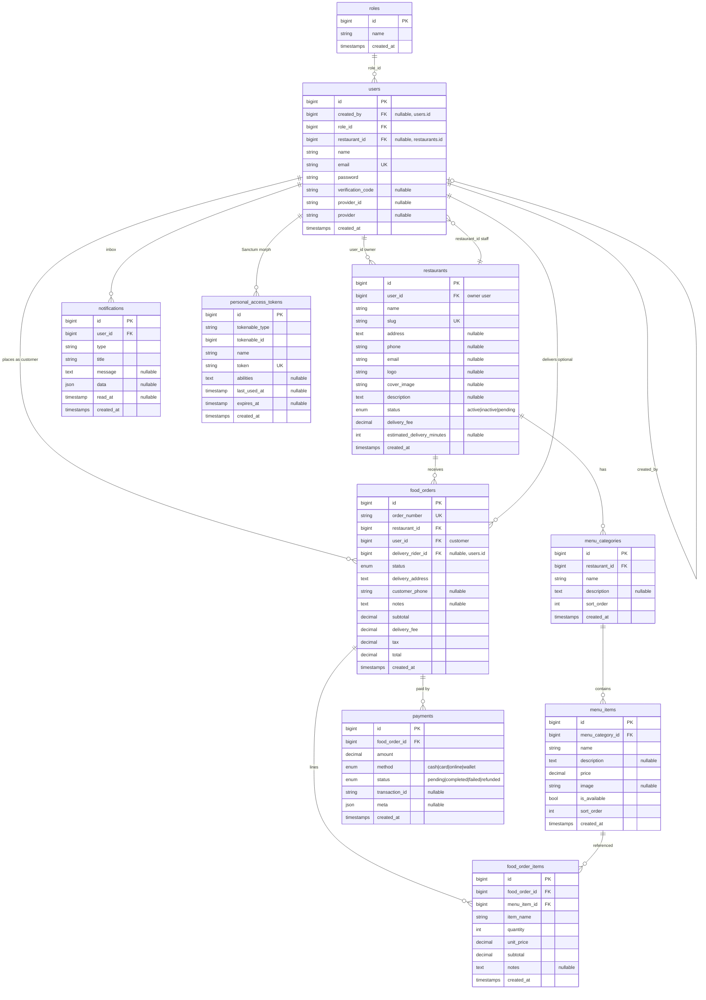

# Use Cases, Order State Machine, and ER Model

**Supplement to:** `docs/THESIS_ONLINE_FOOD_ORDERING_SYSTEM.md`  
**Source of truth for schema:** `database/migrations/*.php` (as of repository state)

This file is suitable for pasting into a thesis **Requirements** or **Design** chapter, or for rendering diagrams in tools that support **Mermaid** (GitHub, GitLab, VS Code extensions, Mermaid Live Editor).

---

## 1. Actors

| Actor | Maps to `users.role_id` (when using `RoleSeeder`) | Description |
|-------|-----------------------------------------------------|-------------|
| **Guest** | — (not authenticated) | Browse public restaurant catalogue. |
| **Customer** | 3 | Register, login, cart, checkout, orders, payments, notifications. |
| **Vendor** | 2 | Restaurant-linked user: profile/restaurant, menu CRUD, order status for own restaurant. Includes accounts created as “manager” by admin (`RestaurantController::adminStore`). |
| **Administrator** | 1 | Manage all restaurants (admin endpoints), riders, view orders. |
| **Delivery Rider** | 4 | View eligible orders, self-assign, update delivery-related statuses. |

---

## 2. Use Case Catalogue

Each use case is written in a form you can copy into a thesis table (**ID, Name, Primary actor, Goal, Preconditions, Main success scenario, Postconditions**).

### 2.1 Authentication and account

| UC-ID | Name | Actor | Goal |
|-------|------|-------|------|
| **UC-A01** | Register account | Guest | Create a user account (default role customer unless specified). |
| **UC-A02** | Login | Guest | Obtain API token and session metadata for SPA. |
| **UC-A03** | Logout | Customer, Vendor, Admin, Rider | Invalidate token and clear client auth state. |
| **UC-A04** | View profile | Customer, Vendor, Admin, Rider | Read name, email, `role_id`, `restaurant_id`. |
| **UC-A05** | Update profile | Customer, Vendor, Admin, Rider | Change display name (and related fields as implemented). |
| **UC-A06** | Change password | Authenticated user | Update password with current credentials flow. |
| **UC-A07** | Request password reset | Guest | Trigger reset flow via email token (as implemented). |
| **UC-A08** | Reset password with token | Guest | Set new password using reset token. |

**UC-A01 main scenario:** Guest submits name, email, password (+ confirmation) → API validates uniqueness → user row created → success message.

**UC-A02 main scenario:** User submits email/password → Laravel authenticates → previous tokens revoked → new Sanctum personal access token issued with role-named ability → SPA stores token and user snapshot.

### 2.2 Catalogue (public)

| UC-ID | Name | Actor | Goal |
|-------|------|-------|------|
| **UC-C01** | List active restaurants | Guest, Customer, … | Paginated list with optional search on name/address. |
| **UC-C02** | View restaurant detail | Guest, Customer, … | Menu categories and **available** menu items for browsing. |

### 2.3 Administrator

| UC-ID | Name | Actor | Goal |
|-------|------|-------|------|
| **UC-M01** | List all restaurants | Admin | Paginated list with search and status filter (any `status`). |
| **UC-M02** | Create restaurant + manager | Admin | Create `restaurants` row (`pending`) and vendor user (`role_id` 2) with credentials emailed. |
| **UC-M03** | List riders | Admin | List users with rider role. |
| **UC-M04** | Create rider | Admin | Create rider account; optional credentials email. |

### 2.4 Vendor (restaurant operator)

| UC-ID | Name | Actor | Goal |
|-------|------|-------|------|
| **UC-V01** | Create restaurant (self-service path) | Vendor | Create restaurant linked to self; set own `restaurant_id` when applicable. |
| **UC-V02** | Update restaurant | Vendor, Admin | Update metadata/status where `authorizeRestaurant` allows. |
| **UC-V03** | Delete restaurant | Vendor, Admin | Remove restaurant when authorized. |
| **UC-V04** | Manage menu categories | Vendor, Admin | CRUD categories for a restaurant. |
| **UC-V05** | Manage menu items | Vendor, Admin | CRUD items within categories. |
| **UC-V06** | List restaurant orders | Vendor | See orders for `restaurant_id` matching vendor. |
| **UC-V07** | Update order status (kitchen flow) | Vendor | Transition order through `confirmed`, `preparing`, `ready`, `delivered`, `cancelled` per validation rules (rider has narrower set). |

### 2.5 Customer

| UC-ID | Name | Actor | Goal |
|-------|------|-------|------|
| **UC-S01** | Build cart (client) | Customer | Add items in Vuex + `localStorage` for one restaurant at a time. |
| **UC-S02** | Place order | Customer | `POST /api/orders` with address, phone, line items; receive `order_number`. |
| **UC-S03** | List my orders | Customer | Paginated orders where `user_id` is current user. |
| **UC-S04** | View order detail | Customer | Single order with items and payments if authorized. |
| **UC-S05** | Record payment | Customer | `POST /api/payments` for own order (method + amount). |
| **UC-S06** | View notifications | Customer | Paginated notifications + unread count. |
| **UC-S07** | Mark notifications read | Customer | Single or bulk read. |

### 2.6 Delivery rider

| UC-ID | Name | Actor | Goal |
|-------|------|-------|------|
| **UC-R01** | List eligible orders | Rider | Orders assigned to rider OR (`status = ready` AND `delivery_rider_id` null). |
| **UC-R02** | Accept / start delivery | Rider | PATCH status to `out_for_delivery` → sets `delivery_rider_id` to self. |
| **UC-R03** | Complete delivery | Rider | PATCH status to `delivered` for assigned order → triggers invoice mail to customer. |

### 2.7 Use case diagram (Mermaid)

> Render this block in any Mermaid-capable viewer.

For a classic **UML use case** oval diagram, redraw the same actors and bundles (Authentication, Catalogue, Admin, Vendor ops, Customer orders, Rider delivery) in your drawing tool; Mermaid’s native `C4`/`usecase` support varies by version, so the flowchart above groups actors to system boundary consistently.

---

## 3. Order status state machine (implemented)

Allowed **enum** values on `food_orders.status` (migration `2026_02_28_100003_create_food_orders_table.php`):

`pending`, `confirmed`, `preparing`, `ready`, `out_for_delivery`, `delivered`, `cancelled`

**Vendor (and non-rider)** may submit (per `FoodOrderController::updateStatus`):  
`confirmed`, `preparing`, `ready`, `out_for_delivery`, `delivered`, `cancelled`

**Rider** may submit only: `out_for_delivery`, `delivered` (with ownership rules in code).

*Note:* In code, when a **rider** sets `out_for_delivery`, `delivery_rider_id` is set to that rider. Business narration for the thesis can describe `ready` as “handoff point from kitchen to logistics.”

---

## 4. Entity–relationship model (from migrations)

### 4.1 Relationship summary

- **roles** 1 — N **users** (`users.role_id` → `roles.id`, ON DELETE cascade).  
- **users** 1 — N **users** (`created_by` self-FK, nullable).  
- **users** 1 — N **restaurants** (`restaurants.user_id` → owner/manager user).  
- **restaurants** 1 — N **users** (`users.restaurant_id`, nullable; vendor staff).  
- **restaurants** 1 — N **menu_categories** → **menu_items**.  
- **users** (customer) 1 — N **food_orders** (`food_orders.user_id`).  
- **restaurants** 1 — N **food_orders**.  
- **users** (rider) 0 — N **food_orders** (`delivery_rider_id`, nullable, ON DELETE set null).  
- **food_orders** 1 — N **food_order_items**; **menu_items** 1 — N **food_order_items**.  
- **food_orders** 1 — N **payments**.  
- **users** 1 — N **notifications**.  
- **personal_access_tokens**: polymorphic `tokenable` → typically **users** (Laravel Sanctum).

### 4.2 ER diagram (Mermaid `erDiagram`)

Attribute lists include the main columns your thesis ER figure should show; adjust if you add migrations later.

**Thesis caption suggestion:** “Figure X — Conceptual ER model derived from Laravel migrations (core ordering domain). Framework tables (`sessions`, `cache`, `jobs`, `password_reset_tokens`) omitted for clarity.”

---

## 5. Optional tables (omitted from diagram)

You may mention in prose that Laravel also maintains **sessions**, **cache**, **jobs**, **password_reset_tokens**, and **failed_jobs** (if enabled) for framework operation; they are not central to the food-ordering domain narrative.

---

## 6. Cross-reference to implementation

| Topic | Primary code locations |
|-------|-------------------------|
| API routes | `routes/api.php` |
| Order rules & notifications | `app/Http/Controllers/API/FoodOrderController.php` |
| Restaurant admin create | `app/Http/Controllers/API/RestaurantController.php` |
| Auth & token abilities | `app/Http/Controllers/AuthController.php` |
| SPA guards | `resources/js/router/index.js` |
| Role string map | `resources/js/services/auth_service.js` |

---

*End of supplement.*
